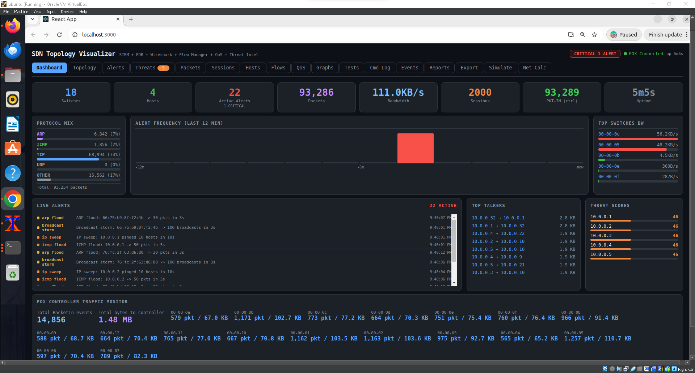
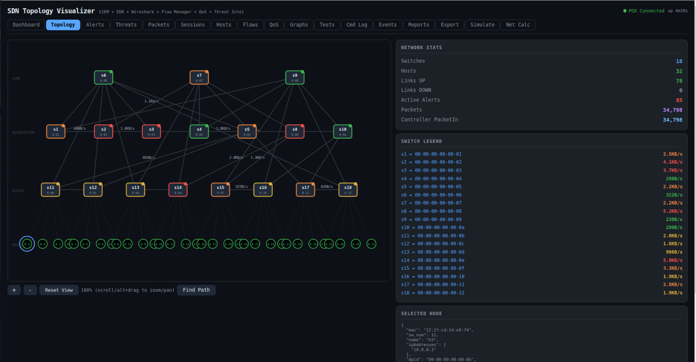
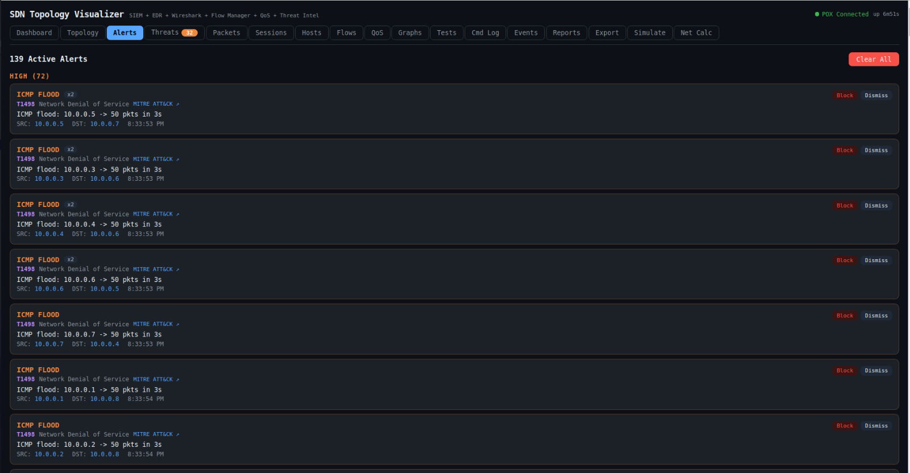
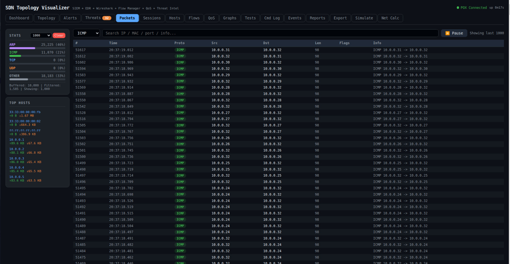

# SDN Network Topology Visualizer

> A live browser-based SDN monitoring dashboard connecting a **POX OpenFlow controller** to a **React.js** frontend.
> Real-time topology, packet capture, SIEM alerts, flow management, threat detection, and 17 monitoring tabs.


## Screenshots

## Dashboard



### Live Topology Map


### SIEM Alerts Dashboard


### Wireshark-Style Packet Capture



## Features

### Network Monitoring
- Live topology map with zoom, pan, and path tracing
- Wireshark-style packet capture (up to 10,000 packets buffered)
- Real-time bandwidth graphs per switch
- Active TCP/UDP session tracker
- Top talkers by bytes exchanged

### Security (SIEM / EDR)
- 10 detection rules: SYN flood, ICMP flood, port scan, ARP flood,
  MAC spoofing, UDP flood, SSH brute force, DNS amplification...
- Per-host threat scoring (0-100, auto-decays over time)
- MITRE ATT&CK technique tags on every alert
- One-click host blocking (installs drop rule on switch)

### Management
- OpenFlow flow table viewer, add, and delete rules
- QoS bandwidth limiting and DSCP marking
- 30 network test types with correct Mininet commands
- 7 attack simulation scenarios
- Export: JSON, CSV, SVG, TXT for all data
- Subnet / CIDR calculator


## Architecture

```
Mininet (virtual network)
    OpenFlow 1.0
        v
POX Controller  +  topology_api.py  (REST on :8000)
    HTTP /topo/
        v
React.js Dashboard  (dev server on :3000, proxied to :8000)
```


## Requirements

| Component | Version | Notes |
|-----------|---------|-------|
| OS | Ubuntu 22.04 LTS | VirtualBox VM works fine |
| Python | 2.7.x | Required by POX — do NOT use Python 3 |
| POX | 0.3.0 (dart) | `git clone https://github.com/noxrepo/pox` |
| Node.js | 16+ (v20 recommended) | Install via nvm |
| Mininet | 2.x | `sudo apt install mininet` |
| Open vSwitch | Any | `sudo apt install openvswitch-switch` |
| hping3 | Any | `sudo apt install hping3` |
| nmap | Any | `sudo apt install nmap` |


## Installation

### 1. Clone the repository
```bash
git clone https://github.com/Khaled74/sdn_topology_visualizer.git
cd sdn-topology-visualizer
```

### 2. Install system dependencies
```bash
sudo apt update
sudo apt install -y mininet openvswitch-switch hping3 nmap arp-scan
```

### 3. Install POX controller
```bash
cd ~
git clone https://github.com/noxrepo/pox.git
```

### 4. Copy the controller module
```bash
cp controller/topology_api.py ~/pox/pox/topology_api.py
cp controller/qos_topo.py ~/Desktop/qos_topo.py
```

### 5. Install Node.js (via nvm)
```bash
curl -o- https://raw.githubusercontent.com/nvm-sh/nvm/v0.39.7/install.sh | bash
source ~/.bashrc
nvm install 20 && nvm use 20
```

### 6. Install React dependencies
```bash
cd dashboard
npm install
```


## Usage

Open three terminal windows and run one command in each.

**Terminal 1 — Start POX**
```bash
cd ~/pox
./pox.py forwarding.l2_learning openflow.discovery \
         openflow.spanning_tree --no-flood --hold-down \
         host_tracker web.webcore topology_api \
         samples.pretty_log log.level --DEBUG
```

**Terminal 2 — Start Mininet**
```bash
sudo mn --custom ~/Desktop/qos_topo.py --topo custom \
        --controller=remote,ip=127.0.0.1,port=6633 \
        --switch=ovs,protocols=OpenFlow10
# Then generate traffic:
mininet> pingall
```

**Terminal 3 — Start Dashboard**
```bash
cd dashboard && npm start
# Opens browser at http://localhost:3000
```


## Dashboard Tabs

| Tab | Description |
|-----|-------------|
| Dashboard | KPIs, top threats, recent alerts, traffic overview |
| Topology | Interactive SVG network map with zoom and path trace |
| Alerts | SIEM alerts with MITRE ATT&CK tags |
| Threats | Per-host threat scores and risk levels |
| Packets | Wireshark-style live packet capture table |
| Sessions | Active TCP/UDP session tracker |
| Hosts | Host intel: MAC, IP, bytes, protocols |
| Flows | OpenFlow flow table — view, add, delete rules |
| QoS | Bandwidth limits and DSCP marking |
| Graphs | Bandwidth history sparklines and alert timeline |
| Tests | 30 network test types with Mininet commands |
| Cmd Log | Timeline of all controller/operator commands |
| Events | POX system event log |
| Reports | Auto-generated security & performance reports |
| Export | Download all data as JSON, CSV, SVG, TXT |
| Simulate | 7 attack scenarios with step-by-step commands |
| Net Calc | Subnet/CIDR calculator + OpenFlow port reference |


## Troubleshooting

**Dashboard shows 'Disconnected'**
Make sure POX is running and the proxy in `dashboard/package.json`
points to `http://localhost:8000`.

**SyntaxError: Non-ASCII character in topology_api.py**
POX uses Python 2.7. The file must be 100% ASCII.
Run: `python -c "open('topology_api.py','rb').read().decode('ascii')"`

**Ghost hosts appearing on topology**
This is normal at startup. Run `pingall` in Mininet to stabilize.

**npm start fails: cannot find module**
Run `cd dashboard && npm install` first.

**Mininet fails to start**
Run `sudo mn -c` to clean up any leftover state, then retry.


## Contributing

Pull requests are welcome. For major changes, open an issue first.
Please test on Ubuntu 22.04 with POX 0.3.0 before submitting.

## License

MIT License - see [LICENSE](LICENS E) for details.
